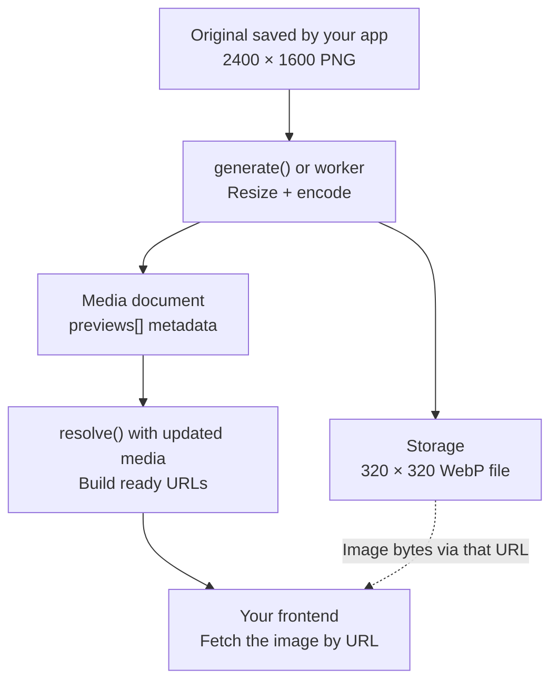
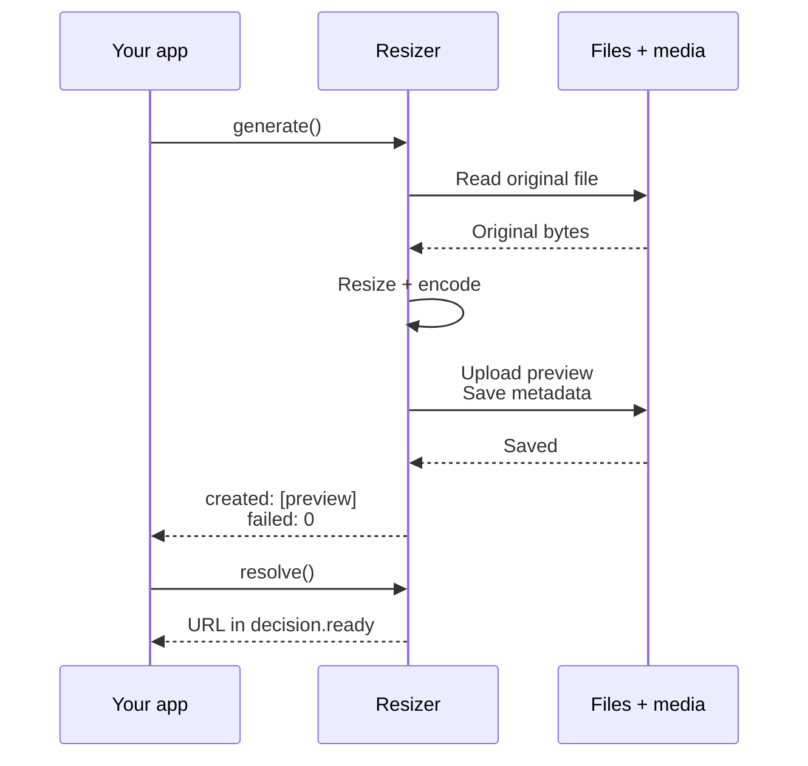
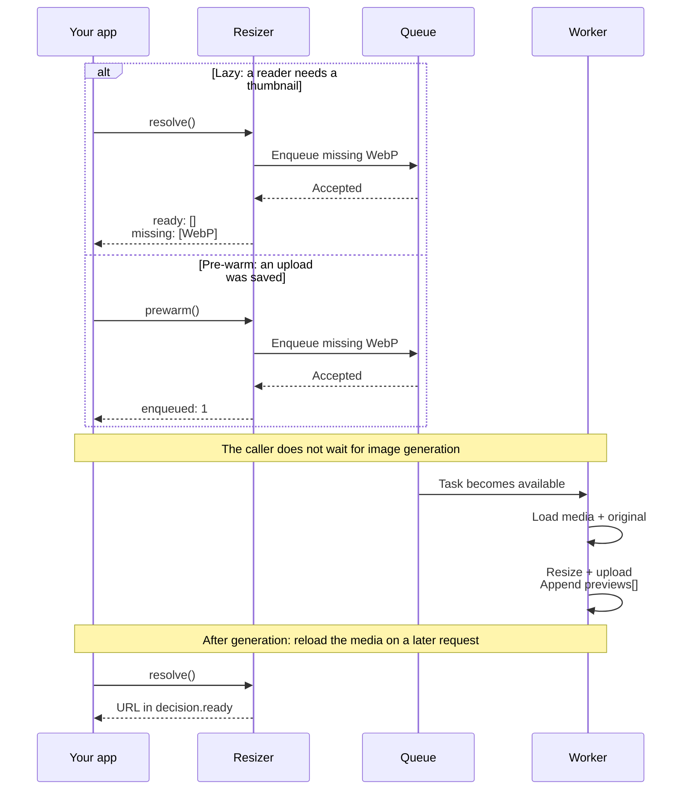

# Image Resizing

`@adaptivestone/framework-module-resize` creates resized copies of images for your framework app. For example, you upload a `2400×1600` photo once, then generate a `320×320` thumbnail for a listing and a larger image for its detail page.

Your app saves the **original image file** and its location on a **media document** such as `File`. The module reads that original, resizes it with `sharp`, uploads the generated files, and adds their metadata to the document's `previews[]`. Your app then asks the module for URLs to include in its responses.

A **preview** is a generated image file. A **variant** is one requested combination of size, output format, and optional filters. One `320×320` size in JPEG, WebP, and AVIF means **three variants and up to three generated files** for the same original photo.

The module supplies the image processing and optional queue integration. Your app supplies the upload endpoint, media model, storage access, response shape, and UI.

The usual path for our `2400×1600` photo and one `320×320` WebP thumbnail is:

<div className="resize-diagram" role="region" aria-label="From an uploaded original to a displayable preview" tabIndex={0}>



</div>

The file lives in storage; `previews[]` contains metadata about it. `resolve()` turns that metadata into ready URLs without processing image pixels. These diagrams show successful generation with default persistence; [original pass-through](#originals-and-private-access) and [errors](#errors) are described below.

## Choose a workflow {/* #modes-eager-vs-pre-warm-vs-lazy */}

| You want… | Call | What happens before it returns | Return value |
|---|---|---|---|
| Previews ready when upload processing finishes | `generate()` — **eager** | Downloads the original, generates/uploads previews, and saves their metadata | `{ created, failed }`: new preview metadata objects and a failure count |
| A fast upload that starts background generation | `prewarm()` — **pre-warm** | Hands missing variants to a queue; the worker generates them later | `{ enqueued }`: number of variants handed to the transport |
| To generate only the sizes requested by readers | `resolve()` with a transport — **lazy** | Finds ready URLs and requests missing variants through the queue | `{ decision, output }`: availability now and an optional custom response |

**Every workflow uses `resolve()` to read image URLs.** In eager mode it reads previews you already generated. In pre-warm mode it reads what the worker has finished. In lazy mode it also starts generation when a preview is missing.

There is no global mode switch. The method you call determines when generation happens. You can pre-warm common thumbnails and lazily request less-used detail sizes. Start with eager if you can wait for image processing at upload; add the queue when you need background generation.

## Choose sizes, formats, and types {/* #sizes--identity */}

Define a fixed **catalog**: an array of sizes your app allows. Reuse it when generating and reading so both calls request the same variants.

```ts
// src/mediaSizes.ts
import type { PreviewFormat, SizeInput } from '@adaptivestone/framework-module-resize';

export const thumbnailSizes: SizeInput[] = [{ width: 320, height: 320 }];
export const detailSizes: SizeInput[] = [{ width: 620 }, { fit: true }];

// The examples on this page choose one format so each thumbnail is one file.
export const previewFormats: PreviewFormat[] = ['webp'];
```

### Size inputs

Dimensions are numbers in pixels. `sizeKey` is the string the module builds to identify that size in stored metadata and response maps; you pass dimensions, not a `sizeKey`, to the public methods.

| `SizeInput` | Generated `sizeKey` | Requested image |
|---|---|---|
| `{ width: 320, height: 320 }` | `320x320` | A square, cropped from the center to fill the box |
| `{ width: 620 }` | `620w` | Width 620, height calculated to preserve aspect ratio |
| `{ height: 400 }` | `400h` | Height 400, width calculated to preserve aspect ratio |
| `{ fit: true }` | `fit` | The whole image, without cropping or enlargement, inside `config.maxSize` (default `2000×1200`) |

For a `2400×1600` original, those requests produce `320×320`, approximately `620×413`, `600×400`, and `1800×1200` respectively. Stored `actualWidth`/`actualHeight` describe the encoded result. The generation limits can cap requested dimensions. With `fit: true`, the fit box comes from config; do not add width/height expecting to change that box.

Only `fit` explicitly prevents enlargement during generation. On reads, some small originals can be served directly; see [original handling](#originals-and-private-access).

Never pass arbitrary client dimensions into `sizes`. Map a client choice such as “thumbnail” to your fixed catalog. Otherwise callers can request unlimited resize work.

### Output formats and content types

`PreviewFormat` accepts exactly these three values:

| Value in `formats` | Generated file | Generated `contentType` | Useful when… |
|---|---|---|---|
| `'jpeg'` | JPEG | `image/jpeg` | You need a JPEG output/fallback. Transparency is flattened onto a background, white by default. |
| `'webp'` | WebP | `image/webp` | Your client accepts WebP, including images with transparency. |
| `'avif'` | AVIF | `image/avif` | Your client accepts AVIF or you offer it as another `<picture>` source. |

Use `'jpeg'`, not `'jpg'`, and `'webp'`, not `'image/webp'`, in `formats`. `contentType` is the MIME type used when serving the file. PNG can be an original, but `'png'` is not a generated preview format. SVG originals pass through unchanged instead of being converted to these formats.

If you omit per-call `formats`, the module uses config, whose default is `['jpeg', 'webp', 'avif']`. Our examples explicitly use `previewFormats = ['webp']`. To generate all three, change that shared array and use it on both generation and reads. Three sizes in three formats can require nine preview files per photo. Requesting AVIF on a later read does not convert a stored WebP file; it requires its own variant.

### TypeScript types you will use

These are exported types; use `import type` from the main package entry. Most call sites can let TypeScript infer results.

| Type | Use it for |
|---|---|
| `MediaLike` | The media document passed to `media`; your model may have additional fields |
| `Original` | Original file location and metadata on `media.original` |
| `SizeInput[]` | Your allowed size catalog |
| `PreviewFormat[]` | Your selected output formats |
| `Preview` / `Preview[]` | Generated file metadata; `generate().created` is a `Preview[]` |
| `GenerateOpts` / `GenerateResult` | A typed `generate()` request/result |
| `PrewarmOpts` | A typed `prewarm()` request; its result is `{ enqueued: number }` |
| `ResolveOpts` / `ReadDecision` | A typed `resolve()` request and its `decision` object |
| `ReadyEntry` / `MissingPreview` | Individual items in `decision.ready` / `decision.missing` |
| `PictureUrls` | The URL map returned by the optional `formatPictureUrls()` helper |

For example, a reusable reader can accept `media: MediaLike` and return `Promise<PictureUrls>`. It does not need the full type of your app's `File` model.

## Set up the module {/* #quick-start-eager--local-filesystem */}

The following setup supports eager generation and reading. The [lazy section](#when-listings-are-huge-lazy--queue) adds a queue and worker to it.

### 1. Install and scaffold {/* #installation */}

Requires Node `>=24`, `@adaptivestone/framework` (`^5.0.1`), and `mongoose`. From your host app's root:

```bash
npm i @adaptivestone/framework-module-resize
```

The resize module ships its own setup generator, **`resize-scaffold`**, as a package executable. Run it from this package explicitly:

```bash
npm exec --package=@adaptivestone/framework-module-resize -- resize-scaffold --eager
```

`--package` names the module that provides the executable. Everything after `--` is the command and its arguments; `--eager` tells the generator to create the eager integration files. Run this in the host app where you installed the module.

The scaffold creates editable `src/resizer.ts` and `src/config/resize.ts`. Existing files are preserved. Without `--eager`, it also creates the task model and worker command, and leaves a required storage placeholder in `src/resizer.ts`.

### 2. Prepare the media model {/* #2-configure-the-media-model-and-storage */}

The module needs a saved media document with `id` or `_id`, an `original` storage location, and a `previews[]` array. The default media store loads and updates that document in MongoDB.

Add `resizeMediaSchemaFragment` to your model's schema. For example, a minimal host model is:

```ts
// src/models/File.ts — keep your own fields when adapting an existing model.
import { BaseModel } from '@adaptivestone/framework/modules/BaseModel.js';
import { resizeMediaSchemaFragment } from '@adaptivestone/framework-module-resize';

export default class File extends BaseModel {
  static get modelSchema() {
    return {
      name: { type: String },
      ...resizeMediaSchemaFragment,
    } as const;
  }
}
```

A media document passed to the module has this shape. This illustrates an already-saved record; use your actual document and storage key in calls:

```ts
import type { MediaLike } from '@adaptivestone/framework-module-resize';

const media: MediaLike = {
  id: '65f000000000000000000001',
  original: {
    key: 'uploads/original-photo.png',
    format: 'png',
    contentType: 'image/png',
    width: 2400,
    height: 1600,
  },
  previews: [],
};
```

`original.key` must locate a file the storage driver can read. S3 originals also normally store `bucket`. Capture display-oriented dimensions at upload if available; generation can backfill missing dimensions. The module does not save your original or create the media document for you. Save both before calling `generate()` or `prewarm()`.

### 3. Configure the model name and storage

```ts
// src/config/resize.ts
import defaultResizeConfig from '@adaptivestone/framework-module-resize/config/resize.js';

export default {
  ...defaultResizeConfig,
  mediaModelName: 'File', // Match your actual media model name.
};
```

The eager scaffold uses local filesystem storage:

```ts
// src/resizer.ts
import { Resizer } from '@adaptivestone/framework-module-resize';
import { LocalFsStorage } from '@adaptivestone/framework-module-resize/storage/fs.js';

export const resizer = new Resizer({
  storage: new LocalFsStorage({
    rootDir: './var/media',
    publicBaseUrl: '/media',
  }),
});
```

With the sample original key, the source file lives at `./var/media/uploads/original-photo.png`. Configure your web server to serve that tree at `/media`. The driver reads/writes files and builds URLs; it does not mount an HTTP route. Local storage uses one public tree for originals and previews; use [S3 or another driver](#drivers--seams) if originals must be private.

### 4. Initialize once per process {/* #3-initialize-once-per-process */}

Construct the `Resizer` after framework initialization. Adapt your HTTP entry, retaining its existing options and other setup:

```ts
// src/server.ts
import Server from '@adaptivestone/framework/server.js';
import folderConfig from './folderConfig.ts';

const server = new Server(folderConfig);
await server.init();
await import('./resizer.ts');
await server.startServer();
```

The dynamic import runs the construction after `init()`. A top-level `import './resizer.ts'` would execute before the entry's initialization code. `startServer()` calls `init()` again, which is a no-op once initialized.

Create **one `Resizer` per process**; a second construction throws. In handlers and DTO builders, use `getResizer()` to access the constructed instance. The CLI/worker needs its own initialization, shown in the lazy setup.

## Eager: generate previews now {/* #reading-the-generate-result */}

Use `generate()` after saving the uploaded original and media document. The call waits for image processing, uploads, and (by default) saving preview metadata. It runs in the calling process and needs no queue or worker.

<div className="resize-diagram resize-diagram--sequence" role="region" aria-label="Eager generation waits for previews to be saved" tabIndex={0}>



</div>

For the one-WebP example, `generate()` returns only after that file and its metadata have been saved. There is no queue in this flow.

```ts
// In your upload handler, after fileDoc and fileDoc.original are saved.
import { getResizer } from '@adaptivestone/framework-module-resize';
import { previewFormats, thumbnailSizes } from './mediaSizes.ts'; // adjust the path

const { created, failed } = await getResizer().generate({
  media: fileDoc,
  sizes: thumbnailSizes,
  formats: previewFormats,
});

console.info('New preview files:', created.length);
if (failed > 0) {
  console.warn(`${failed} variants failed; inspect resize logs`);
}
```

### What `created` and `failed` mean

| Field | Type | Meaning |
|---|---|---|
| `created` | `Preview[]` — an array of objects | Metadata for each new preview file successfully generated and uploaded **by this call**. `created.length` is the number of new files. |
| `failed` | `number` | Count of individual variants whose processing, encoding, or upload failed. It is neither an error object nor an array. |

With our one-size, one-format example, successful generation returns an object like this (the generated storage key is illustrative):

```json
{
  "created": [
    {
      "key": "uploads/preview-example.webp",
      "sizeKey": "320x320",
      "format": "webp",
      "contentType": "image/webp",
      "requestedWidth": 320,
      "requestedHeight": 320,
      "actualWidth": 320,
      "actualHeight": 320
    }
  ],
  "failed": 0
}
```

`created[0]` describes an uploaded image: `key` locates it in storage; `sizeKey` and `format` identify the variant; `actualWidth`/`actualHeight` describe the encoded file. S3 adds `bucket`. Filtered variants carry `filters`, and a fit variant carries `fit: true`. The object contains **metadata, not file bytes or a browser URL**. Use `resolve()` below for URLs.

With default `persist: true`, the new metadata is already appended to the database's `previews[]` and to the supplied `fileDoc.previews` when the call returns. Do not append it again. Existing previews are skipped and are not included in `created` or counted as failures.

If you change the example to request JPEG, WebP, and AVIF, these are the possible outcomes for a valid raster original:

| What happened | What you receive |
|---|---|
| All three are new and succeed | `created.length === 3`, `failed === 0` |
| JPEG exists; WebP and AVIF are new and succeed | `created.length === 2`, `failed === 0` |
| Two new files succeed; one fails | `created.length === 2`, `failed === 1`; the successes are kept |
| All three already exist | `{ created: [], failed: 0 }` |
| All three new variants fail | A thrown `ResizeGenerateError`; no result object is returned |

`failed` does not identify the failed variants or contain error messages; inspect logs and compare the requested catalog with stored previews. An empty catalog or SVG pass-through also returns `{ created: [], failed: 0 }` for a valid original.

With `persist: false`, files are still uploaded, but metadata is neither saved to MongoDB nor appended to your supplied document. Store the returned `created` yourself if later reads should find those files.

`generate()` can also throw on missing originals, source download/validation, a `beforeSteps` failure, or database persistence. `failed` does not replace `try/catch`; see [errors](#errors). Eager calls use no queue/worker locks, even when a transport exists, so concurrent calls are not serialized for you.

## Read URLs in any mode {/* #reading-the-resolve-result */}

Call `resolve()` wherever your app builds a response. It receives the loaded media document and the sizes/formats this view needs. It never runs `sharp`.

```ts
import { formatPictureUrls, getResizer } from '@adaptivestone/framework-module-resize';
import { previewFormats, thumbnailSizes } from './mediaSizes.ts'; // adjust the path

const { decision, output } = await getResizer().resolve({
  media: fileDoc,
  sizes: thumbnailSizes,
  formats: previewFormats,
});

const picture = formatPictureUrls(decision, {
  id: String(fileDoc.id ?? fileDoc._id),
});
```

### What `decision`, `ready`, `missing`, and `output` mean

| Field | Type | Meaning |
|---|---|---|
| `decision` | `ReadDecision` — an object | Groups the ready and missing variants for **this read**. |
| `decision.ready` | `ReadyEntry[]` — an array | Entries with image URLs available now. Each includes `sizeKey`, `format`, `url`, and available `contentType`. Generated entries include `preview` metadata; original-backed entries have `isOriginal: true`. |
| `decision.missing` | `MissingPreview[]` — an array | Requested variants that cannot currently be served, after the `beforeEnqueue` hook. Each describes a size/format and optional filters; there is no URL. |
| `output` | `unknown` | Whatever your optional `formatPublicUrls` hook returned. Without a hook, or if every formatting tap throws, it is `undefined`. |

If the WebP thumbnail exists, `decision.ready[0].url` contains its URL. The `formatPictureUrls()` call groups the ready, unfiltered entries into the following response map (example key):

```json
{
  "id": "65f000000000000000000001",
  "sizes": {
    "320x320": {
      "webp": {
        "url": "/media/uploads/preview-example.webp",
        "contentType": "image/webp"
      }
    }
  }
}
```

Your frontend can use `picture.sizes['320x320']?.webp?.url` as an image URL. With multiple formats, use the available URLs in your `<picture>`/image component and use each entry's `contentType` for its MIME type. The helper does not create images, placeholders, or a pending flag.

### What happens before a preview exists

For our `2400×1600` raster original with no previews, no hooks, and no internal read error, the read result looks like this:

```ts
// Example return value from resolve().
const result = {
  decision: {
    ready: [],
    missing: [
      {
        sizeKey: '320x320',
        format: 'webp',
        requestedWidth: 320,
        requestedHeight: 320,
      },
    ],
  },
  output: undefined,
};
```

There is no thumbnail URL yet. `formatPictureUrls()` returns an empty `sizes: {}` map for that media. Your UI should omit the image or show its own placeholder.

With a configured transport, `resolve()` attempts to enqueue missing variants by default. Without one, it only reads; you must call `generate()` separately to create the missing file. To prevent enqueueing for a particular read, pass `enqueueMissing: false`.

`missing` is an availability list, **not a queue receipt or a list of failed jobs**. The transport may fail, another request may hold the dispatch locks, or enqueueing may be disabled. `resolve()` logs internal failures and returns safely; an empty `missing` array alone is not proof that every requested variant is ready. Check ready URLs and logs.

`resolve()` awaits hooks and any lock, queue, or authorized signing work. It does not wait for the worker. A worker does not update this returned object or the media object already in your process. Fetch the updated document and resolve again to see newly generated previews.

### When to use `output`

Mapping `decision` with `formatPictureUrls()` is enough for the examples above. If you want `resolve()` to return your app's response shape automatically, register a formatting hook once after construction:

```ts
import { formatPictureUrls, getResizer } from '@adaptivestone/framework-module-resize';

getResizer().hook('formatPublicUrls', (decision) => formatPictureUrls(decision));
```

Now `output` is the map returned by that hook (without an `id` in this example). It is typed `unknown` because hooks can return any host response shape. Calling `formatPictureUrls()` yourself does not populate `output`.

`resolve()` never returns `created`, `failed`, `enqueued`, or a task ID. Its job is to describe what can be served now, regardless of how generation was started.

## Lazy: generate missing previews in a worker {/* #when-listings-are-huge-lazy--queue */}

Keep the media model, size catalog, storage, and HTTP initialization from the setup above. Lazy mode adds a **transport** (the queue driver) and a separate **worker process** that consumes its tasks. Your upload handler saves the original and media document without calling `generate()`.

### 1. Add Mongo queue support

Run the same generator shipped by the resize module, this time without `--eager`:

```bash
npm exec --package=@adaptivestone/framework-module-resize -- resize-scaffold
```

This adds `src/models/ResizeTask.ts` and `src/commands/ResizeWorker.ts`. They delegate to the package; keep those thin files rather than copying the implementation. Existing eager files are preserved, so edit your existing constructor to add the transport:

```ts
// src/resizer.ts — replaces the eager constructor.
import { Resizer } from '@adaptivestone/framework-module-resize';
import { MongoTransport } from '@adaptivestone/framework-module-resize/transports/mongo.js';
import { LocalFsStorage } from '@adaptivestone/framework-module-resize/storage/fs.js';

export const resizer = new Resizer({
  transport: new MongoTransport(),
  storage: new LocalFsStorage({
    rootDir: './var/media',
    publicBaseUrl: '/media',
  }),
});
```

The API and worker must share the same database, queue, and image storage. With local storage that means access to the same filesystem tree; for workers on other machines, configure shared storage or [S3](#drivers--seams).

Mongo mode uses the host media model, scaffolded `ResizeTask` model, and framework `Lock` model. Ensure the task model's indexes are created through your normal database deployment process. If your media model is named `Media`, set `mediaModelName: 'Media'` in config and `static fileRef = 'Media'` in the scaffolded `ResizeTask` subclass.

### 2. Allow the worker to run

Set **`worker.enabled: true`** in the host config to permit the worker command to run. The module default is `false`.

```ts
// src/config/resize.ts
import defaultResizeConfig from '@adaptivestone/framework-module-resize/config/resize.js';

export default {
  ...defaultResizeConfig,
  mediaModelName: 'File',
  worker: {
    ...defaultResizeConfig.worker,
    enabled: true,
  },
};
```

This boolean permits worker execution; it does not start a worker in the API. You still launch the separate command below. The API and worker can share this config, and API reads can enqueue regardless of `worker.enabled`.

### 3. Initialize the CLI and start the worker

`src/server.ts` initializes your HTTP process. The worker runs through `src/cli.ts`, so it needs its own `Resizer` construction before the command runs:

```ts
// src/cli.ts
import Cli from '@adaptivestone/framework/Cli.js';
import folderConfig from './folderConfig.ts';

const cli = new Cli(folderConfig);
// Load config first. The selected command still controls model initialization.
await cli.server.init({ isSkipModelInit: true, isSkipModelLoading: true });
await import('./resizer.ts');
const result = await cli.run();
process.exit(result ? 0 : 1);
```

The scaffolded `ResizeWorker` command requests model initialization and uses the active `Resizer`. Run it alongside the API:

```bash
npm run cli ResizeWorker
```

This is a long-running process; keep it supervised by your process manager/container deployment. Starting the API alone does not run it.

### 4. Read using `resolve()`

Use the [same read example](#reading-the-resolve-result): pass your loaded media document, `thumbnailSizes`, and `previewFormats`. No special lazy-read method is needed. With the transport configured, missing variants are enqueued by default.

The return value is still **`{ decision, output }`**: ready URLs and missing variants now, not the worker's eventual generation result. You will not receive `created` or `failed` from a lazy read.

### How background generation works {/* #how-it-works */}

Lazy reads and pre-warming use the same background path; the caller starts it at different times:

<div className="resize-diagram resize-diagram--sequence" role="region" aria-label="Lazy and pre-warm calls do not wait for background generation" tabIndex={0}>



</div>

The queue example assumes one missing thumbnail, a successful enqueue, and no hooks. The worker may start as soon as the task is queued; the diagram separates its work to show what the caller awaits. The lazy return label abbreviates `decision.ready` and `decision.missing`; `output` is `undefined` without a formatting hook. `prewarm()` returns only its count.

For one photo missing its `320×320` WebP thumbnail:

1. Your DTO builder calls `resolve()`. It finds no matching stored preview.
2. It acquires a dispatch lock for that variant and passes it to the transport in one task for this media. It awaits that queue work.
3. It returns `ready: []` and a `missing` entry. Your app can respond with its own placeholder.
4. The worker loads the media by ID, downloads the original, generates/uploads the WebP, and appends its metadata to `previews[]`.
5. A later request loads the updated media and calls `resolve()` again. The ready entry now has a URL.

Multiple missing variants for one media are grouped into one enqueue call after lock filtering. Three missing formats can be one task, not three. The module does not poll the browser, refresh an already-returned DTO, or invalidate your app's caches. Arrange a fresh read if an open page should pick up completed work.

### For large listing pages

Resolve the current page's media and request only the sizes shown by that view. `resolve()` reads the document supplied by the caller; it does not fetch missing `original`/`previews` fields from MongoDB.

```ts
import {
  formatPictureUrls, getResizer, resizeMediaPaths,
} from '@adaptivestone/framework-module-resize';
import { previewFormats, thumbnailSizes } from './mediaSizes.ts'; // adjust the path

// File is your host model; query includes your access and pagination filters.
const files = await File.find(query)
  .select([...resizeMediaPaths, 'name'])
  .limit(20)
  .lean(); // Keep _id selected.

const pictures = [];
for (const file of files) {
  const { decision } = await getResizer().resolve({
    media: file,
    sizes: thumbnailSizes,
    formats: previewFormats,
  });
  pictures.push(formatPictureUrls(decision, { id: String(file._id) }));
}
```

A page of 20 uncached photos with one thumbnail format can request 20 variants in up to 20 tasks. With three formats it can request 60 variants in up to 20 tasks. Existing previews, held locks, hooks, and original handling can reduce those counts.

The example processes a bounded page sequentially. If you parallelize reads, bound that concurrency too: queueing involves I/O. Browser `loading="lazy"` does not defer backend queue writes already performed while building the response. Use `enqueueMissing: false` for reads that must avoid dispatch locks and queue writes, and arrange generation separately. Hooks and any authorized original signing still run.

## Pre-warm: request background generation at upload {/* #reading-the-prewarm-result */}

Use the **same transport and worker setup as lazy mode**, but call `prewarm()` after saving the original and media document. This gives the worker a head start before the first reader arrives. It does not guarantee generation finishes before that read. See the [shared queue flow diagram](#how-it-works).

```ts
import { getResizer } from '@adaptivestone/framework-module-resize';
import { previewFormats, thumbnailSizes } from './mediaSizes.ts'; // adjust the path

const { enqueued } = await getResizer().prewarm({
  media: fileDoc,
  sizes: thumbnailSizes,
  formats: previewFormats,
});
```

### What `enqueued` means

`enqueued` is a **number of variants handed successfully to the transport by this call**, after dispatch-lock filtering. Our one-size, one-WebP example returns this if the thumbnail is missing, its lock is acquired, and the transport accepts it:

```json
{ "enqueued": 1 }
```

With all three formats missing and accepted, it returns `{ enqueued: 3 }`, even though those variants are grouped into one task for that media. Mongo may reuse an identical active task, so this is neither a count of new task rows nor a count of generated files.

`prewarm()` waits for hooks, locks, and the transport call, then returns. **There are no `created` or `failed` fields**: image processing happens later in the worker. Use worker logs/task observers to monitor failures. To display previews, load the updated media and call `resolve()`.

`{ enqueued: 0 }` means this call reported no variants handed successfully to the transport. It can mean all variants already exist, SVG pass-through, held locks, no original key, no transport, or a logged internal failure. Zero alone cannot distinguish those cases. `prewarm()` catches internal failures so queue problems do not reject the upload flow.

You can pre-warm just thumbnails and let detail-page reads lazily request larger variants. `generate()` and `prewarm()` both skip stored identities and SVG originals; neither uses the [original-already-fits shortcut](#originals-and-private-access) used by `resolve()`.

## Method inputs at a glance

| Option | Methods | Type and meaning |
|---|---|---|
| `media` | All, required | `MediaLike`: your loaded/saved media document, including `id` or `_id` |
| `sizes` | All, required | `SizeInput[]`: the fixed catalog for this operation |
| `formats` | All, optional | `PreviewFormat[]`: overrides the configured formats for this call |
| `pipeline` | All, optional | `string`: registered processing name; defaults to `'default'` |
| `ctx` | All, optional | `Record<string, unknown>`: caller context for hooks; eager steps receive it too. It is not stored in queue tasks. |
| `persist` | `generate()` only | `boolean`, default `true`: whether to save generated metadata; `false` still uploads files |
| `enqueueMissing` | `resolve()` only | `boolean`: defaults to `true` with a transport and `false` without one |

Setting `enqueueMissing: true` cannot create a missing transport. Passing a pipeline name does not create its processing functions; register them in the processes that generate images.

## Storage and queue drivers {/* #drivers--seams */}

Supply drivers when constructing your one `Resizer`. `storage` is required. `transport` is optional for eager hosts. The media store and lock provider default to framework implementations.

| Constructor option | Shipped implementations | Purpose |
|---|---|---|
| `storage` | `LocalFsStorage`, `S3Storage` | Read originals, upload previews, build URLs |
| `transport` | `MongoTransport`, `SqsTransport` | Accept tasks and run the worker's consumption loop |
| `mediaStore` | `FrameworkMediaStore` | Load media and append preview metadata |
| `lockProvider` | `FrameworkLockProvider` | Coordinate dispatch and worker attempts |

### S3 storage

Install the optional peers when using S3:

```bash
npm i @aws-sdk/client-s3 @aws-sdk/s3-request-presigner
```

Replace the storage option in your existing construction site:

```ts
import { S3Storage } from '@adaptivestone/framework-module-resize/storage/s3.js';

const storage = new S3Storage({
  bucketPublic: 'my-cdn',
  bucketPrivate: 'my-originals',
  publicBaseUrl: 'https://cdn.example.com',
});
// Pass this as `storage` to the existing new Resizer({ ... }).
```

Use your real bucket names and CDN URL. Credentials/region come from the AWS SDK configuration, or pass a configured `client`. The host creates the buckets and access/CDN policies. `publicBaseUrl` builds URLs; it does not make a bucket public. The old option name `publicUrl` is deprecated.

Original locations normally include `{ bucket, key }`. Generated previews are uploaded with public visibility. API and worker must use compatible storage settings and permissions.

### SQS instead of Mongo tasks

```bash
npm i @aws-sdk/client-sqs sqs-consumer
```

```ts
import { SqsTransport } from '@adaptivestone/framework-module-resize/transports/sqs.js';

const transport = new SqsTransport({
  queueUrl: 'https://sqs.eu-west-1.amazonaws.com/123456789012/resize',
  region: 'eu-west-1',
});
// Pass this as `transport` to the existing new Resizer({ ... }).
```

Use your actual queue URL/region and run the same worker command. SQS does not require the Mongo `ResizeTask` model. It still uses the framework media store and locks unless you replace those drivers. Configure visibility timeout, heartbeat, retries, and DLQ/redrive in SQS/the driver; Mongo queue settings do not configure them.

Custom drivers implement the exported `ResizeStorage`, `QueueTransport`, `MediaStore`, or `LockProvider` contract. They can be objects or classes and close over their own clients; no `app` argument is passed. Storage's optional `canServeOriginalPublicly` tells the reader whether an original is public. Without it, originals are conservatively treated as private. See the package [driver reference](https://github.com/adaptivestone/framework-module-resize#drivers--seams) for all options and subpaths.

## Custom processing: pipelines, filters, and hooks {/* #pipelines--hooks */}

Most apps can use the default resize/encode behavior without registering anything here.

A **pipeline** is named image-processing code. `beforeSteps` receive the source buffer, loaded media, metadata, and context; they run once per generation call/task before resizing. `variantSteps` receive the Sharp image plus `variant`/`ctx`; they run per variant after resize and before encoding. Put watermarks in `variantSteps` so their size is appropriate for each output.

A **filter** is a host-defined value identifying an alternate rendering. `{ blur: 40 }` does not blur anything by itself: your pipeline must implement that meaning.

```ts
// Register after construction in shared setup (API and worker).
import { getResizer } from '@adaptivestone/framework-module-resize';

getResizer().registerPipeline('photo', {
  variantSteps: [
    (img, { variant }) => variant.filters?.blur
      ? img.blur(Number(variant.filters.blur))
      : img,
  ],
});

// In a DTO builder: request a fixed, allowed alternate rendering.
const { decision } = await getResizer().resolve({
  media: fileDoc,
  pipeline: 'photo',
  sizes: [{ width: 320, height: 320, filters: { blur: 40 } }],
  formats: ['webp'],
});
```

Map this filtered decision yourself; `formatPictureUrls()` deliberately excludes filtered entries because its size/format map cannot distinguish them.

Within a media document, preview identity is **size key + format + canonical filters**. Pipeline names are not part of that identity: two pipelines with identical size/format/filters reuse the same stored preview and locks. Use distinct filters for different renderings, including on reads. Changing pipeline code or encode quality does not invalidate existing previews automatically.

Queued tasks carry the pipeline name and requested variants, not functions or `ctx`. Register the processing code in the worker too. An unknown name uses an empty pipeline and does not throw. Queued steps receive `ctx === {}`; persist per-media data for `beforeSteps` on the media document, and carry per-variant settings in your allowed filters. Eager `generate()` passes the caller's real context to both kinds of steps.

**Hooks** customize method inputs, responses, or observation. Register with `getResizer().hook(name, fn)` or the constructor's `hooks` option. Signatures are inferred from the hook name.

| Hook | When it runs | What it returns |
|---|---|---|
| `resolveSizes` | `generate()`, `prewarm()`, and `resolve()`; caller context | The size array to use |
| `beforeEnqueue` | `prewarm()` and `resolve()` (even with enqueueing disabled); caller context | The missing-variant array to keep |
| `formatPublicUrls` | `resolve()`; caller context | The value returned as `output` |
| `onPreviewGenerated` | After persistence in eager/worker generation; context `{}` | Ignored; receives the new `Preview` |
| `afterTaskComplete` | After successful queued handling | Ignored; receives `LeasedTask` and context `{}` |
| `onTaskFailed` | Mongo retryable attempt or SQS handler failure | Ignored; receives task, error, and context `{}` |
| `onTaskDeadLettered` | Mongo terminal/exhausted task | Ignored; receives task, error, and context `{}` |

Taps run in registration order and are awaited. Thrown hook errors are logged and isolated. Observers also emit framework events named `resize:<hookName>`. SQS DLQ transitions are not observed by this module and do not emit `onTaskDeadLettered`.

## Originals and private access

Generated previews are public objects. The host must authorize which media may be processed and returned. Original files have these additional read rules:

- **SVG:** `original.contentType === 'image/svg+xml'` or `original.format === 'svg'` causes untouched pass-through at requested sizes/formats. It is never rasterized or enqueued. Sanitize SVG at upload in your app.
- **A raster original already fits:** when no preview exists, a request with both width and height, no filters, and no `fit: true` can use the original if its known dimensions are both within the box. Width-only, height-only, and fit requests do not use this shortcut. Pipeline steps do not run on an original-backed response.

An original must be publicly servable or accessible through an authorized signed URL. The S3 driver recognizes its public bucket and does not expose private originals anonymously. With a signing-capable driver, server-derived `ctx.isOwner` or `ctx.isAdmin` permits a five-minute signed original URL. Do not accept these flags from client input. Failed signing has no public-URL fallback for a private original. A private SVG that cannot be served yields no ready or missing variants because there is no raster fallback.

Original-backed entries have `isOriginal: true`. Their `format` is the requested slot, while `contentType` describes the original bytes; use the latter for HTML MIME types.

## Configuration

The host's `src/config/resize.ts` is deep-merged over module defaults. Nested objects merge field by field; arrays **replace** defaults. Per-call `formats` overrides the resulting format configuration.

| Option | Default | Meaning |
|---|---|---|
| `mediaModelName` | Required | Your host media model name |
| `formats` | `['jpeg', 'webp', 'avif']` | Formats used when a call omits `formats` |
| `maxSize` | `{ width: 2000, height: 1200 }` | Bounding box for `fit: true` |
| `encode.quality` | `{ jpeg: 80, webp: 82, avif: 64 }` | Separate codec quality settings; the numbers are not comparable across formats |
| `encode.flattenBackground` | `'#ffffff'` | Background when encoding transparent input as JPEG |
| `worker.enabled` | `false` | Whether the worker command is permitted to run |
| `worker.concurrency` | `4` | Parallel variants per generation call/task, including eager calls |
| `worker.sharpConcurrency` | `1` | Sharp/libvips concurrency set when the worker starts |
| `queue.maxAttempts` | `5` | Mongo attempts before dead-letter |
| `queue.taskTimeoutMs` | `600000` | Mongo task timeout in milliseconds |

`webpAvifOnly: true` makes the configured format list `['webp', 'avif']`; explicit per-call formats still override it. Keep `queue.lockTtlMs.worker <= queue.leaseMs`; config resolution rejects the opposite. Storage buckets/URLs and SQS options belong on their drivers, not in resize config. See the [full config reference](https://github.com/adaptivestone/framework-module-resize#config-reference) for encode settings, limits, and queue timing.

## Errors

`generate()` can throw. `resolve()` and `prewarm()` catch and log internal failures, returning a safe read result or `{ enqueued: 0 }`; their results are not detailed error reports. Calling `getResizer()` before construction is a separate setup error outside those method guards.

| Error | Meaning |
|---|---|
| `ResizeSetupError` | Missing/duplicate Resizer or incorrect wiring |
| `ResizeConfigError` | Missing media model name or invalid configuration invariant |
| `ResizeNoOriginalError` | Original absent or lacking a usable storage key; extends `ResizeMediaError` |
| `ResizeMediaError` | Unusable media/source, including metadata/size validation failures |
| `ResizeGenerateError` | Variant errors left no successful new previews; carries numeric `failed` and `requested` |
| `ResizeStorageError` | Package-defined storage failure |
| `ResizeSecurityError` | Refused storage access, such as traversal or an unapproved bucket |

For example, distinguish an all-variants failure when handling eager generation:

```ts
import { getResizer, ResizeGenerateError } from '@adaptivestone/framework-module-resize';
import { previewFormats, thumbnailSizes } from './mediaSizes.ts'; // adjust the path

try {
  const result = await getResizer().generate({
    media: fileDoc,
    sizes: thumbnailSizes,
    formats: previewFormats,
  });
  console.info(`${result.created.length} new files, ${result.failed} variant failures`);
} catch (error) {
  if (error instanceof ResizeGenerateError) {
    console.error(`${error.failed} of ${error.requested} new variants failed`);
  }
  throw error; // Let your upload handler's error policy decide the response.
}
```

Package-defined errors extend `ResizeError` and have a stable `code`. Dependency or host pipeline failures may propagate without that type. Use `ResizeError.isResizeError(error)` to recognize package errors across duplicated package installations, where `instanceof` may not match.

## Helpers

- `formatPictureUrls(decision, { id?, mediaType? })` returns a `PictureUrls` map of ready, unfiltered URLs. It performs no generation or persistence.
- `resizeMediaPaths` is `['original', 'previews'] as const`; spread it into query projections and retain `id`/`_id`.
- `isCatalogCovered(media, sizes, formats)` returns whether every requested identity is stored, or the original is SVG. It does not check storage objects, queue state, original permissions, or execute hooks. If hooks add sizes, checking only the unexpanded catalog is insufficient to skip generation.

The scaffold also supports `--check` for lazy integration files (`--check --eager` for eager), `--out <dir>`, `--eject` for an editable task model, and `--force` to overwrite existing files. By default it appends a guide pointer to the host's `AGENTS.md`; `--agents claude|print|skip` changes that behavior.

## Queue behavior and troubleshooting {/* #operations */}

Mongo tasks move `pending → processing → completed`, or return to `pending` with retry backoff. Exhausted attempts become `dead`. An existing media row without a usable original key is dead-lettered on its first attempt; a deleted media row is a logged no-op completion.

A completed task can have **partial success**: good previews are saved, failed or lock-skipped variants remain missing. A later `resolve()`/`prewarm()` can request them again. Task completion alone does not guarantee that the whole catalog is ready.

Dispatch locks suppress concurrent requests per variant. Mongo also reuses identical active requests through a canonical `requestKey` and a partial unique index. That key includes media ID, pipeline, and the variants that survived dispatch locks. Different/overlapping catalogs may create separate tasks; legacy tasks without a key remain valid. Delivery is at-least-once, with the worker skipping identities already stored on the loaded media document.

The Mongo worker consumes one task at a time per process; `worker.concurrency` controls parallel variants within that task. Run more worker processes to process more media concurrently. Completed rows expire after roughly 24 hours and dead rows after roughly 30 days through the default model's TTL indexes. After fixing a dead task's cause, reload the media and call `prewarm()` with the allowed catalog to request what remains missing. Dead/completed rows do not block a fresh active request.

| Symptom | Check |
|---|---|
| Worker exits with “disabled” | Set `worker.enabled: true` in the host `src/config/resize.ts` |
| Worker reports no Resizer/transport | Construct the Resizer in the CLI process and configure its transport |
| Missing variants but no task rows | `enqueueMissing`, original key, task/lock models, hooks, held dispatch locks, and enqueue logs |
| Tasks remain pending | Worker process/enablement and matching API/worker database/queue |
| Tasks repeatedly fail | Original access, image limits, registered pipeline code, and worker logs |
| Completed task, missing size | Partial failures/skipped locks; requested size/format/filters versus stored previews |
| Mongo has previews, response is empty | Query projection, stale media/DTO caches, and formatting of `decision`/`output` |
| Returned URL gives 404/403 | Filesystem/CDN/bucket access; readiness is based on metadata, not an object-existence probe |

To verify your first setup, save one raster original, generate/request one thumbnail, and inspect its `previews[]`. With a queue, also inspect the task and worker logs. Fetch the media again, resolve it, and open the returned URL.

Your app owns media replacement/invalidation, deletion of storage objects, access checks, and cache refresh. The module appends previews and does not clean up storage when media is deleted.
