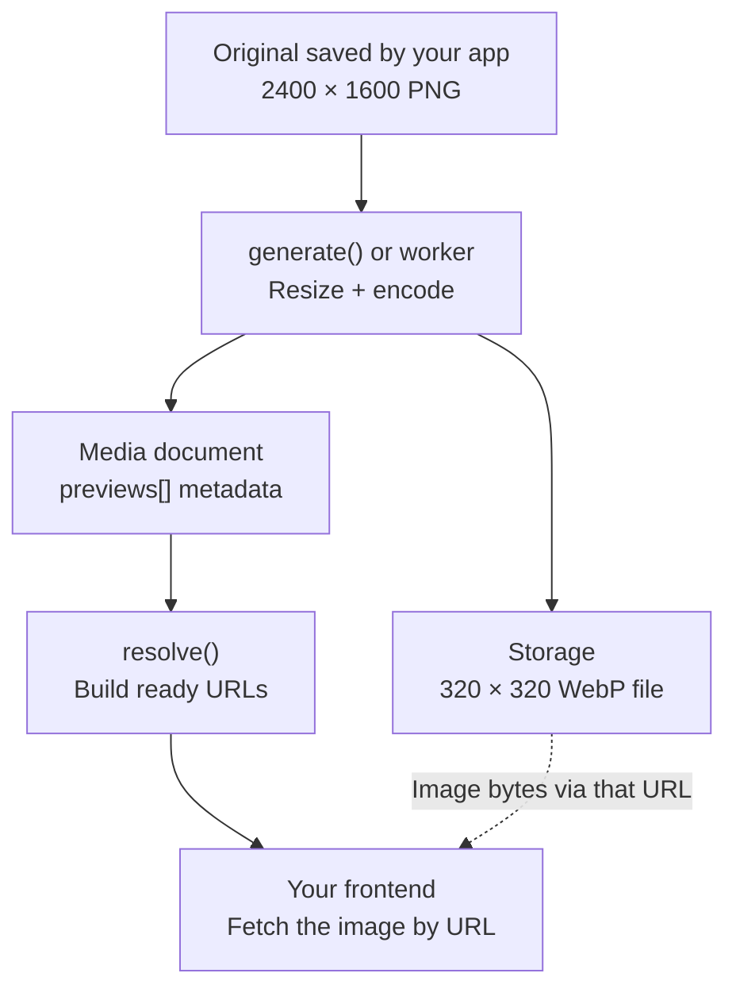
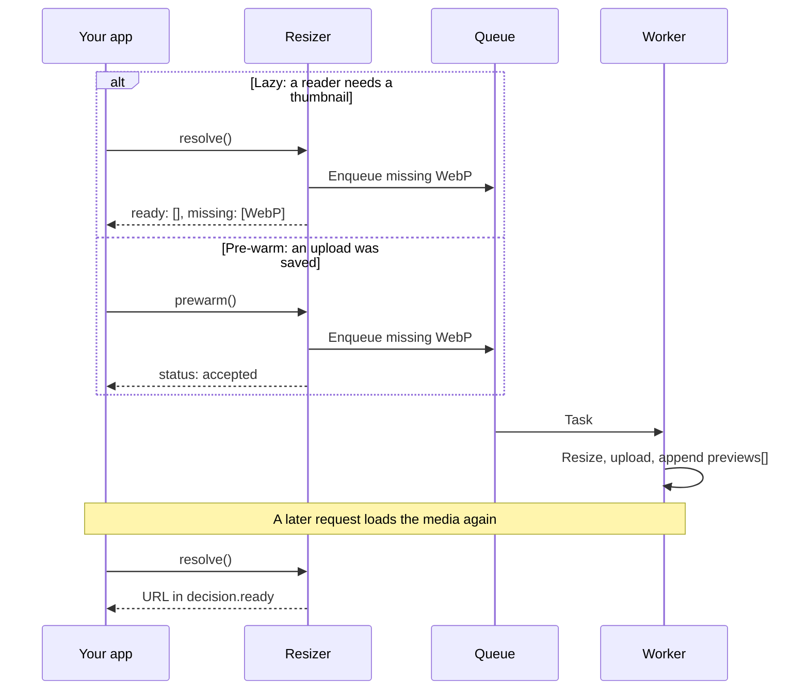

# Image Resizing

`@adaptivestone/framework-module-resize` makes resized copies of uploaded images. You store the uploaded **original** once. The module then creates **previews**, such as a `320×320` thumbnail and a `620`-pixel-wide detail image, with [`sharp`](https://sharp.pixelplumbing.com), stores them, and records them on your media document. When you build a response, it turns that record into image URLs.

- **Original**: the uploaded file, stored unchanged and privately.
- **Preview**: a generated image file. Its metadata is stored in the media document's `previews[]`.
- **Variant**: one requested size and format, plus optional filters. One size in JPEG, WebP and AVIF is three variants, and so three files.

The module handles resizing, storage calls and deciding which URLs are ready. Your app handles the upload endpoint, the media model, access checks, the response shape and deleting files.

<div className="resize-diagram" role="region" aria-label="From an uploaded original to a displayable preview" tabIndex={0}>


```mermaid
flowchart TB
  accTitle: From an uploaded original to a displayable preview
  accDescr: The host saves the original and media document. Generation uploads a preview file and appends its metadata. A read of the updated media produces a URL that the frontend uses to download the preview.
  Original["Original saved by your app<br/>2400 × 1600 PNG"] --> Generate["generate() or worker<br/>Resize + encode"]
  Generate --> File["Storage<br/>320 × 320 WebP file"]
  Generate --> Metadata["Media document<br/>previews[] metadata"]
  Metadata --> Read["resolve()<br/>Build ready URLs"]
  Read --> Frontend["Your frontend<br/>Fetch the image by URL"]
  File -. "Image bytes via that URL" .-> Frontend
```

</div>

## Choose a workflow

| You want… | Call | The call waits for… | It returns |
|---|---|---|---|
| Previews ready when the upload request finishes | `generate()`: **eager** | resizing, upload and saving | `{ created, failed }` |
| A fast upload, with previews made in the background | `prewarm()`: **pre-warm** | queueing and its confirmation | `{ status, … }` per variant |
| Previews only for the sizes readers actually request | `resolve()` with a queue: **lazy** | queueing of the missing variants | `{ decision, output }` |

Every workflow reads URLs with `resolve()` and writes the same `previews[]`. You can mix them, for example pre-warm thumbnails and let detail sizes generate lazily. You can also switch later without migrating data. Start with eager, and add the [queue](#background) when uploads must stay fast.

## Set up

### 1. Install and scaffold

You need Node `>=24`, `@adaptivestone/framework` `^5.1.0`, and `mongoose` 9 (already in a framework app). From your app's root:

```bash
npm i @adaptivestone/framework-module-resize
npm exec --package=@adaptivestone/framework-module-resize -- resize-scaffold --eager
```

`resize-scaffold` ships with the package.

- `--eager` creates `src/resizer.ts` and `src/config/resize.ts`. Without it, the command also creates the queue model and the worker command (see [background generation](#background)).
- It never overwrites existing files; `--force` does.
- It adds a pointer to the package's agent guide to your `AGENTS.md`. Use `--agents claude|print|skip` to change that.
- In CI, run `resize-scaffold --check` (`--check --eager` for eager apps). It fails when a generated file is missing or has been changed in a way that breaks it.

### 2. Add the fields to your media model

```ts
// src/models/File.ts
import { BaseModel } from '@adaptivestone/framework/modules/BaseModel.js';
import { resizeMediaSchemaFragment } from '@adaptivestone/framework-module-resize';

export default class File extends BaseModel {
  static get modelSchema() {
    return { name: { type: String }, ...resizeMediaSchemaFragment } as const;
  }
}
```

The fragment adds:
- `original`: where the original is stored, plus its format, size and dimensions.
- `previews[]`: one entry per generated file. Its `identity` field lets the database keep one entry per preview, so a hand-written schema that declares preview entries as sub-documents needs `identity: { type: String }` in them.

Keep Mongoose's `minimize: false`, which is the `BaseModel` default, because storage locators can contain empty objects. Save the media document before you generate previews; the module never creates it.

### 3. Configure

```ts
// src/config/resize.ts
import type { FrameworkResizeConfig } from '@adaptivestone/framework-module-resize/framework.js';
import { defaultFrameworkResizeConfig } from '@adaptivestone/framework-module-resize/config/resize.js';

export default {
  ...defaultFrameworkResizeConfig,
  mediaModelName: 'File', // your media model
  storage: { driver: 'local', rootDir: './var/media', publicBaseUrl: '/media' },
} satisfies FrameworkResizeConfig;
```

Always spread the defaults. The module validates the complete object and throws `ResizeConfigError` if anything is wrong. Put environment-specific changes in `resize.production.ts` and similar files; the framework merges them. For example, S3 in production only:

```ts
// src/config/resize.production.ts
export default {
  storage: {
    driver: 's3',
    bucketPublic: 'my-cdn',
    bucketPrivate: 'my-originals',
    publicBaseUrl: 'https://cdn.example.com',
  },
};
```

All options are listed under [configuration](#configuration).

### 4. Create the Resizer

```ts
// src/resizer.ts
import { FrameworkResizer } from '@adaptivestone/framework-module-resize/framework.js';

export const resizer = new FrameworkResizer({ pipelines: { default: {} } });
```

`FrameworkResizer` builds everything else from `src/config/resize.ts`: the image settings, the storage, the task queue, the database (`FrameworkDatabase`: your media model `mediaModelName` and the framework's `Lock` model), and the app logger. So `src/resizer.ts` holds only behaviour: pipelines and hooks. Options win over the config; for example, `new FrameworkResizer({ storage: new S3Storage({ …, client }) })` reuses your own S3 client. Import `src/resizer.ts` wherever you need the Resizer; a normal static import is fine, because nothing is read from the framework until first use. Elsewhere in your code, `getResizer()` returns the same instance.

A config mistake then shows up at the first upload or read. To catch it at startup instead, verify after initialization:

```ts
// src/server.ts
await server.init();
await resizer.verify(); // config, storage, media model, and the task queue (ResizeTask model and queue)
await server.startServer();
```

`LocalFsStorage` writes:
- previews under `rootDir`;
- private originals under `privateRootDir`, which defaults to `./var/media-private`.

Serve only `rootDir`, at `/media`; never serve the private folder. For S3, see [drivers](#drivers).

### 5. Store the original at upload

```ts
import { getResizer } from '@adaptivestone/framework-module-resize';

fileDoc.original = await getResizer().uploadOriginal({
  body: buffer, // the uploaded bytes
  visibility: 'private',
  // namespace: `users/${user.id}`, // optional key prefix; not access control
});
await fileDoc.save();
```

`uploadOriginal()` detects the format and dimensions with Sharp, then stores the bytes unchanged under a random name. It returns the value to save as `original`. It does not create the document or queue any work. Input larger than `upload.maxBytes` (25 MiB by default), or in a format not listed in `upload.formats`, throws `ResizeOriginalError`.

Save `original` exactly as returned. Its `storageRef` is the storage driver's own locator: `{ path, visibility }` for local files, `{ bucket, key }` for S3. Never build it by hand.

## Sizes and formats

Define a fixed catalog of sizes for each use, and pass the same catalog when you generate and when you read:

```ts
// src/mediaSizes.ts
import type { PreviewFormat, SizeInput } from '@adaptivestone/framework-module-resize';

export const thumbnailSizes: SizeInput[] = [{ width: 320, height: 320 }];
export const detailSizes: SizeInput[] = [{ width: 620 }, { fit: true }];
export const previewFormats: PreviewFormat[] = ['webp']; // the examples use one format
```

| Size | Key | Result for a `2400×1600` original |
|---|---|---|
| `{ width: 320, height: 320 }` | `320x320` | `320×320`, cropped from the center |
| `{ width: 620 }` | `620w` | about `620×413`, aspect ratio kept |
| `{ height: 400 }` | `400h` | `600×400`, aspect ratio kept |
| `{ fit: true }` | `fit` | `1800×1200`: the whole image inside `maxSize` (`2000×1200`), never enlarged |

For a pipeline without `variantSteps`, a raster original no larger than the requested width and height is never enlarged or cropped: its preview keeps the original's size (scaled down only to fit `limits.resultDimension`), without metadata such as EXIF or GPS. A pipeline with `variantSteps`, such as a watermark, always gets the full box its steps were written for. Fractional dimensions are rounded to whole pixels. No side of a preview other than `fit` exceeds `limits.resultDimension` (5000): when the side derived from the aspect ratio of a width-only or height-only size would, the preview is cropped to it.

:::warning

**The catalog is an allowlist.** Never pass dimensions from the client into `sizes`. Map a client choice such as "thumbnail" to your catalog. Otherwise anyone can make your server resize images to any size they like.

:::

Formats are Sharp output format IDs.
- The `formats` config defaults to `['jpeg', 'webp', 'avif']`, and a call can override it with `formats`.
- Each format is a separate file, so three sizes in three formats make nine files per image.
- Use `'jpeg'`, not `'jpg'`. JPEG previews put transparent areas on a white background.
- Other Sharp formats, such as `'png'` or `'tiff'`, work once you add them to both `formats` and `encode.formats`. A per-call format without an `encode.formats` entry, or one a `beforeEnqueue` hook adds, is never generated: `resolve()` skips it, `prewarm()` reports `RESIZE_FORMAT_NOT_CONFIGURED`, and `generate()` throws.
- SVG is accepted only as an original, and its previews are always raster images: the worker renders the SVG once per task, in a separate process and before any pipeline step, and makes every format from that render. `beforeSteps` receive the rendered PNG, never SVG markup.

## Generate now (eager)

```ts
import { getResizer } from '@adaptivestone/framework-module-resize';
import { previewFormats, thumbnailSizes } from './mediaSizes.ts';

const { created, failed } = await getResizer().generate({
  media: fileDoc,
  sizes: thumbnailSizes,
  formats: previewFormats,
});
```

`generate()` downloads the original, resizes it, uploads the previews and adds their metadata to `previews[]`, all before it returns. The metadata goes both into MongoDB and onto `fileDoc`, so don't add it again. No queue or worker is needed.

| Field | Meaning |
|---|---|
| `created` | `Preview[]`: the files this call made. Previews that already existed are skipped and not listed. |
| `failed` | The number of variants that failed. `failed > 0` is a partial success: the successful previews are saved. |

`generate()` throws `ResizeGenerateError` if every variant fails, and `ResizeNoOriginalError` if the media has no original. So `{ created: [], failed: 0 }` means nothing new was needed. `failed` is only a count; the logs say which variant failed and why.

With `persist: false`, the files are uploaded but their metadata is not saved, so store `created` yourself. Eager calls take no locks, so two concurrent calls for the same media can both generate the same variants.

## Read URLs

```ts
import { formatPictureUrls, getResizer } from '@adaptivestone/framework-module-resize';

const { decision } = await getResizer().resolve({
  media: fileDoc,
  sizes: thumbnailSizes,
  formats: previewFormats,
});
const picture = formatPictureUrls(decision, { id: String(fileDoc.id) });
// { id: '65f0…', sizes: { '320x320': { webp: { url: '/media/previews/8d0e2b7c.webp', contentType: 'image/webp' } } } }
```

`resolve()` never resizes and never throws. It returns:

| Field | Meaning |
|---|---|
| `decision.ready` | Stored previews that can be served now, each with `sizeKey`, `format`, `url`, `contentType` and the `preview` row; never the original |
| `decision.missing` | Variants that cannot be served yet; they have no URL |
| `output` | The return value of your `formatPublicUrls` hook, or `undefined` if you have none |

`formatPictureUrls()` leaves missing sizes out of its map, so show your own placeholder for them.
- **With a queue configured:** `resolve()` also queues the missing variants. Pass `enqueueMissing: false` to only read.
- **Without a queue:** it only reads.
- **New previews:** `resolve()` never waits for the worker. To see new previews, load the media again on a later request.

`formatPictureUrls()` also skips variants that have filters; build the response from `decision` yourself for those. To get your own response shape directly, register a hook once: `getResizer().hook('formatPublicUrls', (decision) => toMyDto(decision))`. `output` then holds what that hook returns.

On list pages, select only the module's fields and resolve one bounded page:

```ts
import { resizeMediaPaths } from '@adaptivestone/framework-module-resize';

const files = await File.find(query).select([...resizeMediaPaths, 'name']).limit(20).lean();
const pictures = [];
for (const file of files) {
  const { decision } = await getResizer().resolve({ media: file, sizes: thumbnailSizes, formats: previewFormats });
  pictures.push(formatPictureUrls(decision, { id: String(file._id) }));
}
```

`resolve()` uses only the fields you loaded. In lazy mode every read can write to the queue, so keep pages bounded.

## Generate in the background {/* #background */}

### Add the queue and the worker

1. Run the scaffold without `--eager`. It adds `src/models/ResizeTask.ts` (the queue's model) and `src/commands/ResizeWorker.ts` (the worker command), and keeps your existing files:

   ```bash
   npm exec --package=@adaptivestone/framework-module-resize -- resize-scaffold
   ```

2. Choose the task queue, where tasks wait for the worker, and allow the worker to run. In `src/config/resize.ts`:

   ```ts
   queue: { driver: 'database' }, // tasks in the ResizeTask model; or { driver: 'sqs', queueUrl }
   worker: { ...defaultFrameworkResizeConfig.worker, enabled: true },
   ```

   Without `queue` (or with `queue: false`) the Resizer is eager only. `worker.enabled` only permits the worker command; the API never starts a worker. `src/resizer.ts` does not change.

3. Check the queue timing if your images are large: `queue` also takes `leaseMs`, `maxAttempts` and the other [timing options](#configuration).

4. Create the indexes. `ResizeTask` and the framework's `Lock` model declare their indexes. Create them through your normal migration or deployment process before you deploy the API and the worker. The module never creates indexes at runtime. Mongo's duplicate detection depends on the partial unique index on active tasks. When you upgrade from an earlier version, create the claim index `{ queue: 1, status: 1, availableAt: 1 }` before or together with the new workers, then drop the old `{ status: 1, createdAt: 1 }` (or `{ queue: 1, status: 1, createdAt: 1 }`) index.

5. Start the worker as a separate long-running process, kept running by your process manager:

   ```bash
   npm run cli ResizeWorker
   ```

The scaffolded command imports `src/resizer.ts`, so the worker has the same Resizers as the API:

```ts
// src/commands/ResizeWorker.ts (scaffolded)
import '../resizer.ts';

export { ResizeWorker as default } from '@adaptivestone/framework-module-resize/framework.js';
```

Keep that import if you edit the command; `resize-scaffold --check` reports a command without it. The API and the worker must use the same database and the same storage. With `LocalFsStorage` that means the same filesystem; for workers on other machines, use S3 or other shared storage.

### Lazy and pre-warm

<div className="resize-diagram resize-diagram--sequence" role="region" aria-label="Lazy and pre-warm calls do not wait for background generation" tabIndex={0}>


```mermaid
sequenceDiagram
  accTitle: Queueing and background generation are separate
  accDescr: Resolve on a read or prewarm after upload enqueues a missing thumbnail and returns without waiting for generation. A separate worker takes the task, creates the preview, and saves metadata. A later resolve with freshly loaded media returns a ready URL.
  participant App as Your app
  participant Resizer
  participant Queue
  participant Worker
  alt Lazy: a reader needs a thumbnail
    App->>Resizer: resolve()
    Resizer->>Queue: Enqueue missing WebP
    Resizer-->>App: ready: [], missing: [WebP]
  else Pre-warm: an upload was saved
    App->>Resizer: prewarm()
    Resizer->>Queue: Enqueue missing WebP
    Resizer-->>App: status: accepted
  end
  Queue->>Worker: Task
  Worker->>Worker: Resize, upload, append previews[]
  Note over App,Worker: A later request loads the media again
  App->>Resizer: resolve()
  Resizer-->>App: URL in decision.ready
```

</div>

**Lazy** needs no extra code: `resolve()` queues whatever is missing. **Pre-warm** queues the catalog right after the upload is saved, so the worker usually finishes before the first reader arrives:

```ts
const result = await getResizer().prewarm({
  media: fileDoc,
  sizes: thumbnailSizes,
  formats: previewFormats,
});
if (result.status === 'incomplete') {
  // result.unconfirmed: variants without a confirmed task
  // result.issues: why, and whether a retry can help (issue.retryable)
}
```

`prewarm()` never throws, and it reports every requested variant. All variants for one media go into one task.

| `status` | Meaning |
|---|---|
| `'ready'` | Nothing needs queueing, and at least one requested variant is already stored |
| `'accepted'` | Every variant that needs queueing has a confirmed task (`result.tasks`) |
| `'not-required'` | Nothing to do: the request was empty, or the `beforeEnqueue` hook removed everything |
| `'incomplete'` | At least one variant has no confirmed task, for example because there is no task queue or no original |

The arrays `ready`, `accepted`, `notRequired` and `unconfirmed` split the requested catalog, and `result.tasks` holds the task receipts. Sometimes another request is queueing the same variant at the same moment. With the database queue, `prewarm()` confirms that variant by finding the other request's active task. A queue that cannot look tasks up, such as SQS, returns such a variant as `incomplete` and retryable. An unexpected error, for example a media document without an ID, is `incomplete` with a `RESIZE_ENQUEUE_INTERNAL_ERROR` issue.

### Queues and workers {/* #named-queues */}

Every task waits in a named queue. When you don't name one, it is `'default'`.

| You want… | How |
|---|---|
| A Resizer's tasks on another queue | `new FrameworkResizer({ …, queue: 'bulk' })` |
| One call's tasks on another queue | `prewarm({ …, queue: 'bulk' })`; `resolve()` also accepts `queue` |
| A worker for `'default'` | `npm run cli ResizeWorker` |
| A worker for another queue | `npm run cli ResizeWorker -- --queue=bulk` |

A worker consumes exactly one queue. A common setup keeps uploads and reads on `'default'` and runs a large backfill on `'bulk'` with its own worker, so the backfill never delays new uploads.

Any number of workers, on any number of servers, can consume one queue; each task is processed by one worker at a time. If a worker dies, its lease (its time-limited hold on the task) expires and another worker takes the task. A task can therefore run more than once, but the worker skips previews that already exist.

## More than one Resizer

Most apps need one Resizer. Create more when parts of the app need different storage, media models or formats, for example avatars and listings:

```ts
// src/resizer.ts
export const resizer = new FrameworkResizer(); // 'default', src/config/resize.ts
export const listings = new FrameworkResizer({
  name: 'listings',
  configName: 'resizeListings', // src/config/resizeListings.ts, a complete config like resize.ts
});

// elsewhere: getResizer('listings').resolve({ … })
```

- **One construction per name:** each name can be created only once per process.
- **Create them all in `src/resizer.ts`:** every task records which Resizer created it, and the worker gives the task to the Resizer with that name, so the worker needs all of them. Creating them in `src/resizer.ts` gives both the API and the worker the same set.
- **Own config files:** each file has its own media model, storage, queue and image settings. Resizers on the same backend share one task queue: every Resizer with `queue: { driver: 'database' }`, and Resizers whose SQS settings are identical. The worker runs one loop per task queue, one task at a time, and processes each task with its own Resizer. A task queue has one timing, so files that share one must set the same timing options (and, for SQS, the same `waitTimeSeconds`, where unset means the default 10); otherwise the first use, `verify()` and the worker fail with `RESIZE_CONFIG_QUEUE_TIMING_CONFLICT`.
- **No mixing:** previews from different Resizers never mix.
- **Worker settings:** the worker reads its own settings (`worker.enabled` and the Sharp tuning) from `src/config/resize.ts`. To read them from another file, for example when your app has only `resizeListings.ts`, start it with `npm run cli ResizeWorker -- --config=resizeListings`.

## Pipelines, filters and hooks

If you register nothing, the module only resizes and encodes. For custom image processing, register a **pipeline** in `src/resizer.ts`, so the worker has it too:

```ts
export const resizer = new FrameworkResizer({
  pipelines: {
    photo: {
      beforeSteps: [],  // run once per task on the source image, e.g. blur faces or plates
      variantSteps: [   // run per variant, after resize and before encode
        (img, { variant }) => (variant.filters?.blur ? img.blur(Number(variant.filters.blur)) : img),
      ],
    },
  },
});

// A read that asks for that rendering:
await getResizer().resolve({
  media: fileDoc,
  pipeline: 'photo',
  sizes: [{ width: 320, height: 320, filters: { blur: 40 } }],
});
```

- **Watermarks go in `variantSteps`.** In `beforeSteps`, the watermark is applied to the original and shrinks until it is unreadable in small previews.
- **A filter such as `{ blur: 40 }` does nothing by itself.** Your `variantSteps` give it meaning.
- **`ctx` does not reach the worker.** Queued tasks carry only the pipeline name and the variants, and steps in the worker receive `ctx === {}`. Keep any data a step needs on the media document. Only eager `generate()` passes your `ctx` to the steps.
- **Each pipeline keeps its own previews.** A preview is identified by Resizer, pipeline, size, format and filters. Changing a pipeline's code does not regenerate existing previews; give the pipeline a new name, such as `photo-v2`, to do that.
- **Register a pipeline before you request it, in every process.** A name the Resizer doesn't know (any name but `default`) is never rendered: `resolve()` serves only previews already stored for it and queues nothing, `prewarm()` reports `RESIZE_PIPELINE_UNKNOWN`, and `generate()` and the worker throw it. When you add or rename a pipeline, deploy the worker before the API starts requesting it: a worker without the pipeline fails its tasks, retries them with backoff, and dead-letters them after `queue.maxAttempts`.
- **Adding pipelines later:** `getResizer().registerPipeline(name, pipeline)` adds or replaces one after construction.

**Hooks** customize inputs and responses, or observe events. Register them with `hooks:` at construction or with `getResizer().hook(name, fn)`. TypeScript infers each signature from the hook name.

| Hook | Runs | Returns |
|---|---|---|
| `resolveSizes` | `generate()`, `prewarm()`, `resolve()` | The sizes to use |
| `beforeEnqueue` | `prewarm()` and `resolve()`, before queueing | The missing variants to keep |
| `formatPublicUrls` | `resolve()` | The value returned as `output` |
| `onPreviewGenerated` | After each new preview is saved | Nothing |
| `afterTaskComplete` | After a queued task stored every variant | Nothing |
| `onTaskFailed` | After a failed attempt that will be retried | Nothing |
| `onTaskDeadLettered` | After a task fails for the last time | Nothing |

Hook functions run in the order they were registered, and each one is awaited. A function that throws is logged and skipped. The framework event bus also receives the four observer hooks (the last four rows) as `resize:<hookName>`.

## Drivers {/* #drivers */}

| Part | Config (`FrameworkResizer`) | Driver class | Import from |
|---|---|---|---|
| storage (required) | `storage: { driver: 'local' \| 's3', … }` | `LocalFsStorage`, `S3Storage` | `…/drivers/fs.js`, `…/drivers/s3.js` |
| database: media and locks | always `FrameworkDatabase` | `FrameworkDatabase`, `MongoDatabase` | `…/framework.js`, `…/drivers/mongo.js` |
| task queue (queued work only) | `queue: { driver: 'database' \| 'sqs', … }` | `MongoTaskQueue`, `SqsTaskQueue` | `…/drivers/mongo.js`, `…/drivers/sqs.js` |

In a framework app you choose drivers in the config file; pass a driver object to `new FrameworkResizer({ storage, db, tasks })` only when the config can't express it, for example your own S3 client. The S3 and SQS drivers are loaded only when selected.

The module itself runs the queue: the worker loop, the lease, retries with backoff, dead-lettering and the task events. A task queue driver only stores tasks, so Mongo and SQS behave the same. `FrameworkDatabase` is a thin wrapper over the framework-free `MongoDatabase`: it takes your media model from the app, keeps locks in the framework's own `Lock` model, and uses the `ResizeTask` model as its task queue (`queue: { driver: 'database' }`).

**S3** needs `npm i @aws-sdk/client-s3 @aws-sdk/s3-request-presigner` (3.572 or newer):

```ts
// src/config/resize.ts (or resize.production.ts)
storage: {
  driver: 's3',
  bucketPublic: 'my-cdn',        // previews
  bucketPrivate: 'my-originals', // originals; must differ from bucketPublic
  publicBaseUrl: 'https://cdn.example.com',
  region: 'eu-west-1',           // optional; also endpoint and forcePathStyle for S3-compatible stores
},
```

Credentials come from the AWS SDK's default chain, never from the config. To use an existing `S3Client`, pass `storage: new S3Storage({ …, client })` from `…/drivers/s3.js` in code instead. When an environment file switches `storage` from `local` to `s3`, set `publicBaseUrl` there too: the framework merges the section field by field. You create the buckets and their access policies; `publicBaseUrl` only builds URLs. The driver reads only from these two buckets, so a tampered `storageRef` cannot reach another bucket.

**SQS** needs `npm i @aws-sdk/client-sqs`, version 3.572 or newer: older clients don't return receive counts, so failing tasks would never be dead-lettered.

```ts
// src/config/resize.ts (or resize.production.ts)
queue: {
  driver: 'sqs',
  queueUrl: 'https://sqs.eu-west-1.amazonaws.com/123456789012/resize',              // queue 'default'
  queues: { bulk: 'https://sqs.eu-west-1.amazonaws.com/123456789012/resize-bulk' }, // optional
  deadLetterQueueUrl: 'https://sqs.eu-west-1.amazonaws.com/123456789012/resize-dead', // optional
  region: 'eu-west-1',
  maxAttempts: 5, // the timing options work as for Mongo
},
```

SQS needs no `ResizeTask` model; media and locks stay in your database. Retries and dead-lettering work as with Mongo, and `onTaskDeadLettered` fires for SQS too. A redrive policy on the SQS queue is optional; if you keep one, set its `maxReceiveCount` above `maxAttempts`, so the module dead-letters a task first. A task whose lease ran out can still run twice on SQS; the worker skips previews that already exist.

Every kind of driver has an exported abstract class: `ResizeStorage`, `ResizeDatabase` and `TaskQueue`. A custom driver extends one (for example `class PostgresDatabase extends ResizeDatabase`), or is any object of the same shape. Drivers receive no `app` argument; each one uses its own clients. The [package reference](https://github.com/adaptivestone/framework-module-resizer#drivers) lists every option and contract.

## Originals, SVG and private access

Previews are public. Store originals privately (`visibility: 'private'`). Your app decides who may upload, read and delete media.

- **SVG is untrusted.** An SVG file can contain scripts and external references, so the module never serves SVG markup, not even to its owner.
  - `uploadOriginal()` accepts SVG only with `visibility: 'private'`.
  - The generator renders it into your raster formats and never loads anything the file references. The render runs in a separate Node process and is killed after `limits.processingTimeoutSeconds` or when the task stops. Your app must allow child processes (`--allow-child-process` under Node's permission model), and a bundle must keep `svgRasterChild.js` next to `svgRaster.js`.
  - The stored file is not cleaned, so never serve it yourself.
- **The module never serves an original.** `resolve()` returns stored previews only, whoever reads; `ctx` reaches your hooks but does not change the result. A small raster original gets a preview at its own size instead, unless the pipeline has `variantSteps` (see [sizes](#sizes-and-formats)).
- **To give an owner the private original,** check access in your app and call the storage driver yourself. `S3Storage` signs URLs; `LocalFsStorage` has no `signedUrl`.

  ```ts
  const resizer = getResizer();
  await resizer.ready(); // loads the drivers built from the config
  const url = await resizer.storage.signedUrl?.(fileDoc.original.storageRef, 300); // valid for 5 minutes
  ```

## Without the framework

The core and the shipped drivers contain no framework code, and the framework is an optional peer dependency. A plain Node app with MongoDB uses the Mongo drivers and writes no driver code:

```ts
import mongoose from 'mongoose';
import { Resizer, runWorker } from '@adaptivestone/framework-module-resize';
import defaultResizeConfig from '@adaptivestone/framework-module-resize/config/resize.js';
import { LocalFsStorage } from '@adaptivestone/framework-module-resize/drivers/fs.js';
import { mongoDatabase } from '@adaptivestone/framework-module-resize/drivers/mongo.js';

// Media, locks and the task queue, with the package's ResizeTask / ResizeLock models.
// Call it once: each call makes its own task queue, so pass this db.tasks to every Resizer.
const db = mongoDatabase(mongoose.connection, { mediaModel: File }); // File spreads resizeMediaSchemaFragment

const resizer = new Resizer({
  config: { ...defaultResizeConfig, formats: ['webp'] },
  storage: new LocalFsStorage({ rootDir: './var/media', publicBaseUrl: '/media' }),
  db,
  tasks: db.tasks, // optional: queued workflows only; or new SqsTaskQueue({ queueUrl })
});

// In the worker process:
await runWorker({ signal: shutdown.signal, queue: 'default' });
```

- `mongoDatabase()` registers `ResizeTask` (the queue) and `ResizeLock` on that connection with the package's schemas and indexes, and turns `autoIndex` off: create the indexes of both through your migration process (for example `await mongoose.connection.models.ResizeTask.createIndexes()`, and the same for `ResizeLock`). For other setups, `new MongoDatabase(…)` and `new MongoTaskQueue(…)` take your models directly.
- `config` is optional and holds image settings only. Queue timing (`leaseMs`, `lockTtlMs`, `maxAttempts`, …) belongs to the task queue (`mongoDatabase(…, { timing })`, `new SqsTaskQueue({ timing })`), and Sharp tuning is `runWorker({ sharp: { concurrency, cache } })`.
- `storage`, `db` and `tasks` may also be functions, sync or async, called once on first use; `await resizer.ready()` loads them, and the Resizer's own methods do it for you.
- The framework adapter (`…/framework.js`) does exactly this wiring for you, from the config file.

## Configuration

`src/config/resize.ts` spreads `defaultFrameworkResizeConfig` and adds `mediaModelName`, `storage`, `queue` plus your changes. The framework merges `resize.<NODE_ENV>.ts` over it: objects merge field by field, and arrays are replaced. The image settings go to the Resizer; `FrameworkResizer` builds the drivers from `storage` and `queue`, and the worker command reads `worker`.

| Option | Default | Meaning |
|---|---|---|
| `mediaModelName` | required | Your media model's name |
| `storage` | required (unless passed in code) | `{ driver: 'local', rootDir, publicBaseUrl, privateRootDir? }` or `{ driver: 's3', bucketPublic, bucketPrivate?, publicBaseUrl?, region?, endpoint?, forcePathStyle? }` |
| `queue` | none: eager only | `{ driver: 'database' }` or `{ driver: 'sqs', queueUrl, queues?, deadLetterQueueUrl?, waitTimeSeconds?, region?, endpoint? }`, plus the timing options below; `false` = eager only |
| `formats` | `['jpeg', 'webp', 'avif']` | Formats generated when a call doesn't pass `formats`; each needs an `encode.formats` entry |
| `upload.maxBytes` | 25 MiB | Largest original `uploadOriginal()` accepts |
| `upload.formats` | `jpeg`, `png`, `webp`, `avif`, `gif`, `svg` | Original formats `uploadOriginal()` accepts |
| `maxSize` | `{ width: 2000, height: 1200 }` | The box for `fit` |
| `encode.formats` | JPEG quality 88, WebP 82, AVIF 64 | Sharp encoder options per format; `{}` keeps Sharp's defaults |
| `animated` | `false` | `true`: WebP and GIF previews of an animated original keep its frames (up to `limits.animationFrames`, 64), unless the pipeline has `variantSteps`; other formats and pipelines with variant steps use the first frame |
| `concurrency` | `4` | Variants processed in parallel per task or `generate()` call |
| `worker.enabled` | `false` | Allows the worker command to run |
| `queue.maxAttempts` | `5` | Attempts before a task is dead-lettered |
| `queue.leaseMs`, `queue.lockTtlMs` | `60000`, `{ dispatch: 60000, worker: 60000, failed: 600000 }` | The task lease and lock TTLs; the worker lock must not outlive the lease. After a task is dead-lettered, reads do not queue its previews again for `failed` milliseconds |
| `queue.retryBackoffMs`, `queue.idlePollMs`, `queue.taskTimeoutMs` | `{ base: 5000, max: 300000 }`, `1000`, `600000` | Retry delay, how often an idle worker polls for new tasks (one indexed query per worker on Mongo), and the task time limit |

To change one encoder setting, spread the nested defaults:

```ts
encode: {
  ...defaultFrameworkResizeConfig.encode,
  formats: { ...defaultFrameworkResizeConfig.encode.formats, avif: { quality: 55, effort: 4 } },
},
```

The [full config reference](https://github.com/adaptivestone/framework-module-resizer#config-reference) covers limits, sharpening, animation and queue timing. Keys renamed since 0.2 fail with `RESIZE_CONFIG_REMOVED_KEY`:

| 0.2 key | Use instead |
|---|---|
| `webpAvifOnly: true` | `formats: ['webp', 'avif']` |
| `encode.quality.<format>`, `encode.effort.<format>` | `encode.formats.<format>.quality`, `encode.formats.<format>.effort` |
| `encode.mozjpeg`, `encode.chromaSubsampling` | `encode.formats.jpeg.mozjpeg`, `encode.formats.jpeg.chromaSubsampling` |
| `encode.flattenBackground` | `encode.flatten.background` |

## Errors

`resolve()` and `prewarm()` never throw: they log the failure and return a safe result (`prewarm()` reports it as an issue). Every other error from the module extends `ResizeError` and carries a stable `code`:

| Error | Meaning | What to do |
|---|---|---|
| `ResizeSetupError` | The wiring is wrong, e.g. a duplicate Resizer name | Fix the code |
| `ResizeConfigError` | The config is invalid or incomplete | Fix the config; `resizer.verify()` reports it at startup |
| `ResizeOriginalError` | Uploaded bytes are invalid, unsupported or too large | Reject the upload |
| `ResizeNoOriginalError` | The media has no original | Upload the original first |
| `ResizeMediaError` | The media can't be used; the two errors above extend it | Skip that media |
| `ResizeGenerateError` | `generate()` made nothing, or a queued task left variants missing | Check `failed`, `requested`, `missing` and the logs |
| `ResizeStorageError` | A storage operation failed | A retry may help |
| `ResizeSecurityError` | A refused storage access, such as path traversal | Never retry; investigate |

```ts
import { ResizeError, ResizeNoOriginalError } from '@adaptivestone/framework-module-resize';

try {
  await getResizer().generate({ media: fileDoc, sizes: thumbnailSizes });
} catch (err) {
  if (err instanceof ResizeNoOriginalError) return badRequest('Upload the image first');
  if (ResizeError.isResizeError(err)) return badRequest(err.message);
  throw err; // not from this module
}
```

If two copies of the package are installed, `instanceof` can fail across them. `ResizeError.isResizeError(err)` still works in that case.

## Operations and troubleshooting {/* #operations */}

- **Task states.** Mongo tasks go `pending → processing → completed`. A failed attempt returns to `pending` with a growing delay. After `queue.maxAttempts`, the task becomes `dead`.
- **Partial attempts.** A task completes only when every requested variant is stored. When an attempt is only partly successful, its previews are saved and the next attempt makes only the missing ones.
- **Cleanup and retries.** Completed tasks are removed after about 24 hours and dead tasks after about 30 days. To retry a dead task after fixing its cause, call `prewarm()` again for that media once `queue.lockTtlMs.failed` (10 minutes by default) has passed since the task died.
- **One row per preview.** The database stores each preview identity once. When two workers render the same preview, the second upload is logged as a warning with its storage location and is not recorded; delete such files if you need to.
- **Throughput.** A worker processes one task at a time from each task queue, and `concurrency` parallelizes the variants within it. For more throughput, run more worker processes.
- **Shutdown.** On SIGTERM or SIGINT the worker stops claiming tasks, lets the variants in progress finish and saves them, and puts the task back in the queue without an `onTaskFailed` event or a retry delay; the next worker makes the rest. A task whose original is missing or unusable is still dead-lettered. With the database queue this does not count as an attempt; with SQS it does. Custom queues: see the `release` method in the [package reference](https://github.com/adaptivestone/framework-module-resizer#drivers).

| Symptom | Check |
|---|---|
| Worker exits with "disabled" | `worker.enabled: true` in `src/config/resize.ts`, or in the file named with `--config` |
| Worker stops at start with `RESIZE_NO_RESIZER` | `src/commands/ResizeWorker.ts` must import `../resizer.ts`; delete the old file and run `resize-scaffold` again |
| Worker logs `RESIZE_NO_RESIZER` for a task | That Resizer must be created in `src/resizer.ts` |
| `verify()` or the worker fails with `RESIZE_MONGO_MODEL_MISSING` | The `ResizeTask` model is not registered (scaffold `src/models/ResizeTask.ts`), or the framework's `Lock` model is missing |
| `verify()` or the worker fails with `RESIZE_MONGO_MODEL_OUTDATED` | Your ejected or hand-written `ResizeTask` model lacks the `resizer`, `queue`, `requestKey` or `availableAt` field: add them (and the `{ queue, status, availableAt }` index), or delete the file and run `resize-scaffold --eject` again |
| `verify()` or the worker fails with `RESIZE_MONGO_MEDIA_MODEL_OUTDATED` | Your media schema declares preview entries as sub-documents without `identity`: spread the current `resizeMediaSchemaFragment`, or add `identity: { type: String }` to the entry |
| `RESIZE_CONFIG_QUEUE_TIMING_CONFLICT` | Two config files share a task queue but set different timing; the message names both files and the keys |
| Worker logs `RESIZE_SVG_RENDER_TIMEOUT` or `RESIZE_SVG_RENDER_FAILED` | An SVG took longer than `limits.processingTimeoutSeconds` to render (dead-lettered at once), or its render process crashed (retried) |
| `RESIZE_SVG_RENDER_UNAVAILABLE` from the worker or `generate()` | The SVG render process cannot start: allow child processes (`--allow-child-process` under Node's permission model), and keep `svgRasterChild.js` next to `svgRaster.js` when bundling |
| `verify()` or the worker fails with `RESIZE_CONFIG_MEDIA_MODEL_UNKNOWN` | `mediaModelName` must name a registered model |
| `verify()` or the first call fails with `RESIZE_PEER_MISSING` | The S3 or SQS driver selected in the config needs its AWS SDK packages: install the ones named in the message |
| `RESIZE_PIPELINE_UNKNOWN` in `prewarm()` issues, from `generate()` or in worker logs | That process has no pipeline with this name: register it in `src/resizer.ts`, and deploy the worker before the API |
| `RESIZE_FORMAT_NOT_CONFIGURED` | A call or a `beforeEnqueue` hook asked for a format without an `encode.formats` entry, such as `'jpg'`: use a configured format ID |
| Tasks stay `pending` | Is a worker running for that queue (`--queue`), on the same database? |
| `verify()` or the first upload fails with `RESIZE_CONFIG_STORAGE_MISSING` | Add `storage: { driver: 'local', … }` (or `'s3'`) to the config file named in the message |
| Worker stops with `RESIZE_QUEUE_NOT_SERVED` | No task queue serves that queue, for example an `SqsTaskQueue` without it in `queues`: add the queue URL, or start the worker for another queue |
| Variants are missing but there are no tasks | `enqueueMissing`, the original's `storageRef`, the indexes, hooks and logs; `prewarm()` reports the reason per variant |
| Tasks fail repeatedly | Original access, image limits, pipeline code and worker logs; `RESIZE_WORKER_INCOMPLETE` lists the missing variants |
| `previews[]` has entries but the response is empty | The query projection (`resizeMediaPaths`), stale caches, or how you map `decision` |
| A returned URL gives 404 or 403 | Static-file, CDN or bucket access; the module doesn't check whether the file exists |

Your app owns replacing and deleting media and their storage files (the module only adds previews), access checks, and refreshing cached responses.
